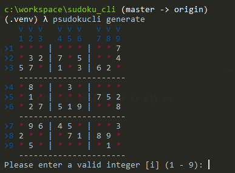

## 控制台数独游戏



### 步骤

```bash
https://github.com/a2htray/sudoku-cli.git
cd sudoku-cli
python setup.py install
```

## 选项

* `--coordinate/--no-coordinate` 开启坐标系，默认打开
* `--check/--no-check` 每一步进行合法检查，默认打开
* `--mode` 关卡难度，`easy`, `medium`, `hard`, `extreme`,默认难度为`medium`

```bash
# 不开启坐标
# 每步不进行检查
# 难度为 extreme
sudokucli generate --no-coordinate --no-check --mode extreme
```

## 资源

* 在线生成数独游戏 [http://www.opensky.ca/~jdhildeb/software/sudokugen/](http://www.opensky.ca/~jdhildeb/software/sudokugen/)